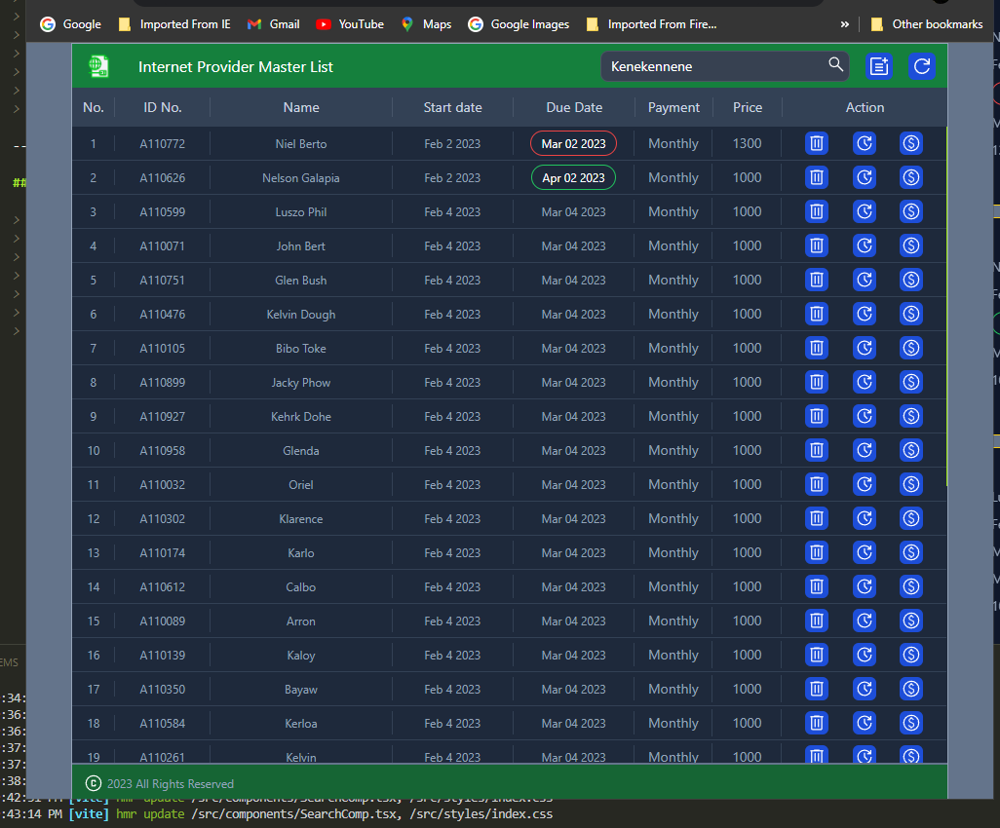
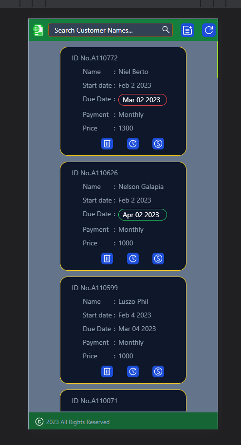
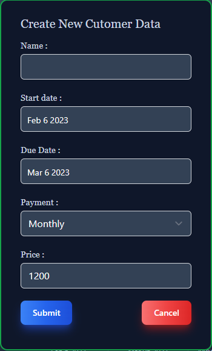
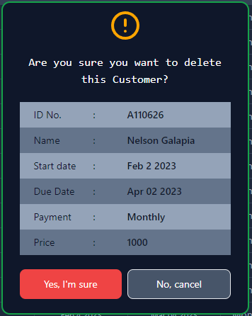
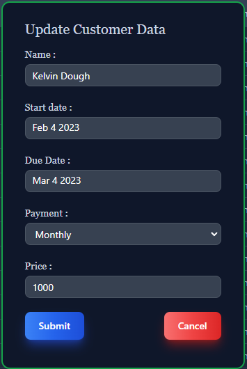
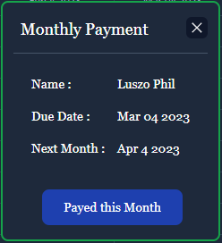
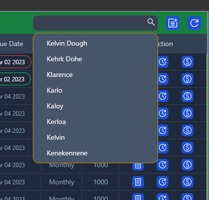
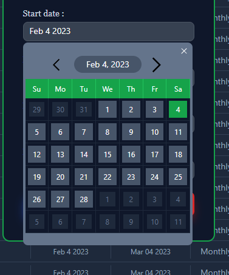

## Internet Service Provider Monthly Payment Mnitoring

---

> ### Front-End Vite + React + Typescript Project + Axios+
>
> ### Back-End Nodejs + Express + xlsx.
>
> > #### Download or Clone It:
> >
> > ```bash
> >  npm i or npm install
> >  npm run dev
> > ```

---

### Sample Screen Shot:

> ##### Full Screen:
>
> > 
>
> ##### Small Screen
>
> > 
>
> ##### Create List Names
>
> > 
>
> ##### Delete Customer Data
>
> > 
>
> ##### Update Customer Data:
>
> > 
>
> ##### Update Payment
>
> > 
>
> ##### Search List of Names
>
> > 
>
> ##### Date Picker
>
> > 
